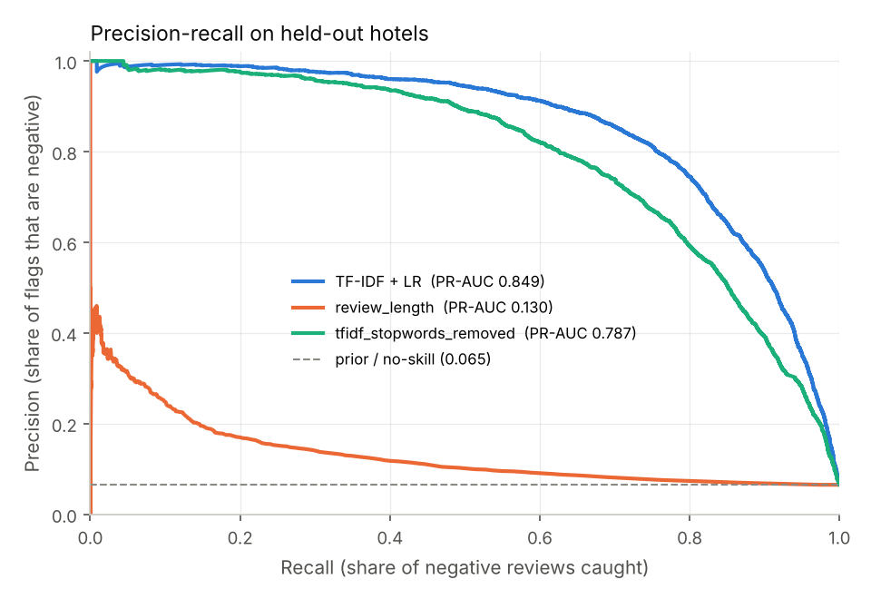
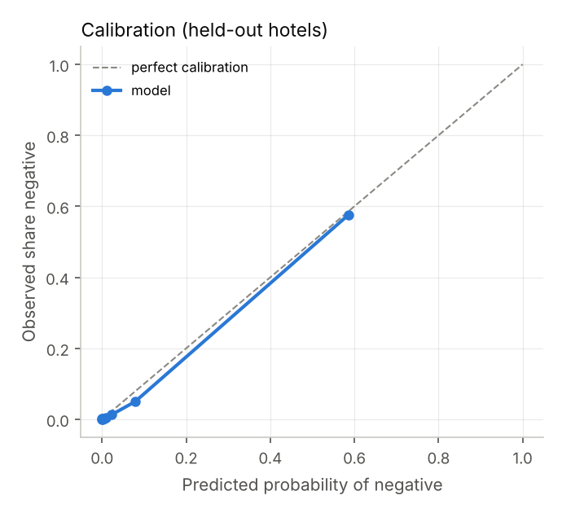
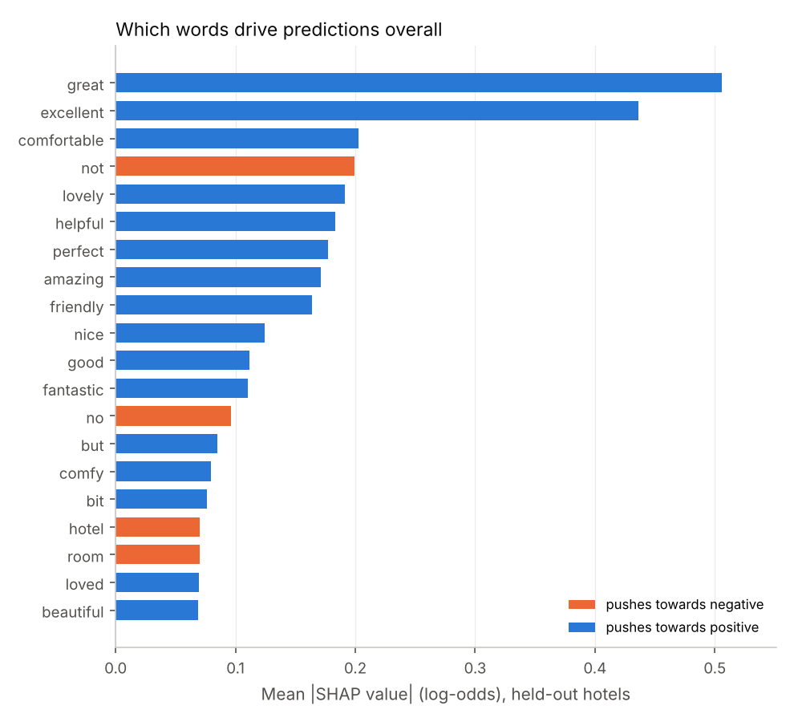
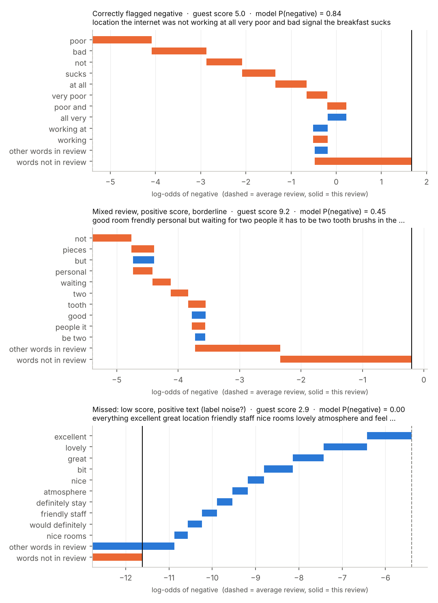

# Hotel Review Sentiment — flagging unhappy guests from free text

[](https://github.com/Muneera-DSA/Hotel-Review-Sentiment-Analysis/actions/workflows/ci.yml)

A review-level sentiment classifier for **515K Booking.com reviews of 1,492 European hotels**, built as a triage tool. Given a guest's free-text review, it scores how likely the guest was unhappy, so a guest-relations team can prioritise service-recovery responses.

**At a glance** (299 hotels never seen in training):

| | |
|---|---|
| Model | TF-IDF (unigrams + bigrams) → logistic regression, one scikit-learn `Pipeline` |
| PR-AUC | **0.849** (95% CI 0.820–0.872). No-skill baseline: 0.065 |
| Across 5 further random hotel splits | PR-AUC 0.867 ± 0.010 |
| At the chosen threshold | Catches **81%** of unhappy guests by reading **7.2%** of reviews; **73%** of flagged reviews are genuinely negative |
| Calibration | Predicted probabilities match observed rates (see figure) |
| Explainability | Exact SHAP values per review and globally |

Full evidence: [`reports/metrics.md`](reports/metrics.md) (main run), [`reports/validation.md`](reports/validation.md) (validation suite), [`MODEL_CARD.md`](MODEL_CARD.md) (intended use and limits).

---

## 1. Problem framing

| | |
|---|---|
| **Decision supported** | Which new reviews should a guest-relations team read and respond to first? |
| **Unit of prediction** | One review (all text the guest wrote) |
| **Target** | `is_negative = 1` if `Reviewer_Score ≤ 5.0`; `0` if `≥ 8.0`; reviews scoring 5.0–8.0 are excluded as ambiguous |
| **Input at prediction time** | Review text only. No score, no hotel average, no metadata |
| **Cost of a false negative** | An unhappy guest is not answered, with reputational and repeat-business cost |
| **Cost of a false positive** | A staff member reads a review that didn't need action, costing minutes |
| **Primary metric** | **PR-AUC** for the negative class. It is the minority class, and ROC-AUC flatters performance under imbalance |
| **Operating point** | Threshold chosen to reach ≥ 80% recall, using out-of-fold *training* predictions only |

## 2. Data

Source: [Kaggle — 515K Hotel Reviews Data in Europe](https://www.kaggle.com/datasets/jiashenliu/515k-hotel-reviews-data-in-europe). Setup instructions are in [`data/README.md`](data/README.md). The exact file used is identified by its SHA-256 fingerprint in [`reports/validation.md`](reports/validation.md).

| Issue | Handling |
|---|---|
| Empty fields hold Booking.com placeholders (`"No Negative"`, `"No Positive"`) that give away the score | Removed. They are site artefacts, not guest language |
| Positive and negative fields are separate boxes; real free text has no such split | Concatenated into one document per review. The model is not told which box text came from |
| Exact duplicate rows, and the same text posted twice for one hotel | Removed |
| `Average_Score` includes the review being predicted | Not used (target leakage) |
| No human sentiment labels | Label derived from `Reviewer_Score` with an excluded middle band; sensitivity tested (§5) |
| File might not be the expected dataset | Schema and value-range checks run on load |

After cleaning: **363,666 reviews** from 1,492 hotels, 8.4% negative. 149,128 reviews were excluded as ambiguous. Every exclusion is counted in `reports/metrics.json`.

## 3. Method

```
raw CSV → validate → strip placeholders → concatenate fields → normalise text
       → label from score → de-duplicate → split by HOTEL (80/20)
       → [train only] GroupKFold CV over C (PR-AUC) → out-of-fold threshold @ 80% recall
       → refit on all training hotels → single evaluation on held-out hotels
```

- **Preprocessing.** Lowercasing, contraction expansion (`wasn't` → `was not`), letters only.
- **No stopword removal, no lemmatisation.** Standard stopword lists contain *not / no / nor*, so removing them turns *"room was not clean"* into *"room clean"*. The cost of removing them is measured (§5) rather than assumed.
- **Model.** `TfidfVectorizer(ngram_range=(1,2), min_df=5, max_df=0.9, sublinear_tf=True)` → `LogisticRegression` (liblinear). `C` is tuned with 5-fold `GroupKFold` by hotel on training data only; `C = 4` was selected.
- **Class imbalance.** No re-weighting or resampling. Imbalance is handled by choosing the threshold explicitly. The alternatives were tested and all made the model worse (§5).

**Leakage controls** (each enforced in code and covered by tests):
- Test hotels never appear in training. A test fails if any hotel is in both sets.
- Duplicates are removed before splitting.
- Score-revealing placeholders are removed.
- Tuning and threshold selection use training data only.
- The vectorizer is fitted inside the pipeline, so it never sees test text.

## 4. Results

| Model (held-out hotels) | PR-AUC | ROC-AUC |
|---|---|---|
| No-skill (base rate) | 0.065 | 0.500 |
| Review length only | 0.130 | 0.624 |
| TF-IDF, unigrams only | 0.802 | 0.967 |
| TF-IDF, stopwords removed (negations lost) | 0.787 | 0.964 |
| **TF-IDF unigrams + bigrams (final)** | **0.849** (95% CI 0.820–0.872) | **0.975** |

Confidence intervals come from a **cluster bootstrap over hotels**, which is the unit of the split. Reviews of the same hotel are correlated, so resampling rows would give intervals that are too narrow.

**Operating points.** The thresholds are chosen on training data; the outcomes below are measured on held-out hotels, per 1,000 incoming reviews, of which about 65 are from unhappy guests:

| Target recall | Reviews to read | Unhappy guests caught | Missed | Reads that weren't needed |
|---|---|---|---|---|
| 70% | 56 | 47 | 18 | 9 |
| **80% (default)** | **72** | **53** | **12** | **20** |
| 90% | 110 | 59 | 6 | 52 |
| 95% | 169 | 62 | 3.5 | 107 |

Moving from 80% to 95% recall catches 9 more unhappy guests per 1,000 reviews, but needs 2.3× the reading (169 reviews instead of 72), and most of the extra reads turn out not to be needed. Which point is right depends on staff capacity and the value of a recovered guest. That is a business decision this table is meant to inform.

| Precision–recall vs baselines | Calibration |
|---|---|
|  |  |

The model is well calibrated: a predicted 0.6 means roughly 60% of such reviews are negative. The probabilities can therefore be used directly, for example to forecast daily response workload.

## 5. Validation — is the performance real, stable and fit for purpose?

All checks are produced by `python -m hotel_sentiment.validate`; full tables are in [`reports/validation.md`](reports/validation.md).

| Question | Check | Finding |
|---|---|---|
| Was the headline split lucky? | 5 more random sets of test hotels | PR-AUC 0.853–0.875 (mean 0.867). The primary split is the **hardest** of the six, so 0.849 is conservative |
| Do bigrams help, or is it noise? | Paired hotel bootstrap, 1,000 resamples | +0.042 PR-AUC (CI +0.035 to +0.050); every resample positive |
| Does keeping "not" / "no" matter? | Same | +0.056 (CI +0.047 to +0.067); every resample positive |
| Does class re-weighting help? | Same | **No**: removing it gives +0.015 (CI +0.012 to +0.018), and calibration improves |
| Do SMOTE / oversampling help? | [`experiments/imbalance_comparison.py`](experiments/imbalance_comparison.py) | No. No balancing 0.849 · class weights 0.835 · oversampling 0.829 · SMOTE 0.818 |
| What does SMOTE *before* the split do? | Same | **Inflates PR-AUC from 0.863 to 0.992** on the same model. Synthetic test rows are blends of training rows, and the test set becomes 50% negative. A textbook leak |
| Does it depend on the 5 / 8 label cut-offs? | Retrain with ≤4/≥9 and ≤6/≥7 | 0.872 (stricter) and 0.732 (looser). The looser definition includes genuinely borderline reviews, which supports excluding the middle band |
| Is it memorising stock phrases? | Test reviews whose exact text never appears in training (96% of test) | PR-AUC 0.855, the same as overall. Performance is not driven by repeated text |
| Does it work for non-native English writers? | Reviewer nationality | ROC-AUC 0.971 (other countries) vs 0.977 (English-speaking); recall 0.81 for both |
| Does it work across cities? | Hotel city | ROC-AUC 0.966–0.979 in all six cities. Vienna is the weakest (recall 0.74) |
| Where is it weakest? | Review length | Very short reviews (1–10 words): recall 0.64. Reviews over 30 words: recall 0.87–0.96 |

**Behavioural tests (minimal pairs).** These probe what the model actually understands:

| Test | Pass rate | Example |
|---|---|---|
| Adding "not" to praise raises the negative score | **10/10** | *"the room was clean"* 0.13 → *"the room was not clean"* 0.995 |
| Negating a complaint lowers the negative score | **4/8** | *"the room was dirty"* 0.997 → *"the room was not dirty"* 1.000 ❌ |
| City, hotel name, punctuation don't change the score | **4/5** | Appending a neutral clause (*"we visited in june"*) lowered a negative review from 0.51 to 0.11 ❌ |

These failures are the known limits of a bag-of-n-grams model:
- **Negated complaints.** *not* carries strong negative weight on its own, so *"not dirty"* reads as doubly negative.
- **Dilution.** TF-IDF vectors are length-normalised, so neutral filler words dilute the signal from complaint words.

Both point to the same next step: a model that reads word order (a fine-tuned transformer), compared on this same hotel split.

## 6. Explainability (SHAP)

`python -m hotel_sentiment.explain` computes **exact SHAP values**. For a linear model the closed form is φⱼ = wⱼ·(xⱼ − E[xⱼ]), with E[x] the mean training review. This is what `shap.LinearExplainer` computes; a test checks the two match, and an additivity check confirms the SHAP values sum to the model output to within 10⁻¹⁴.

| Global importance | Individual reviews |
|---|---|
|  |  |

- **Globally**, the presence of strong praise (*great*, *excellent*, *comfortable*) carries the most weight, followed by *not* and *no*. Because most reviews are positive, the model mainly learns to recognise satisfaction, and treats its absence as a warning sign.
- **Per review**, the waterfall shows which words moved the score. The bar labelled *"words not in review"* is the effect of the review *lacking* the usual praise words: a complaint that never says *great* or *excellent* is pushed towards negative for that reason too.
- **The third example is a "missed" negative that is really label noise.** The text is glowing (*"everything excellent … would definitely stay again"*) but the guest scored 2.9. Many of the most confident errors in [`reports/error_analysis.csv`](reports/error_analysis.csv) look like this. They are likely guests misreading the rating scale (a hypothesis, not verified), so true recall is probably slightly **understated**.

## 7. Limitations

- **Labels are a proxy.** The guest's overall score is not an annotation of the text, and the error analysis shows label noise. Hand-labelling a few hundred reviews would measure it.
- **Bag of n-grams.** Negated complaints and dilution by neutral text fail behavioural tests (§5). Sarcasm and long-range context are not captured.
- **Short reviews** (1–10 words, about a quarter of reviews) are the weakest segment.
- **Single source and period.** Booking.com, six European cities, 2015–2017. Transfer to other platforms, markets or later years is untested; the temporal split gives only a first indication.

## 8. Reproduce

```bash
git clone https://github.com/Muneera-DSA/Hotel-Review-Sentiment-Analysis.git
cd Hotel-Review-Sentiment-Analysis
python -m venv .venv && source .venv/bin/activate   # Windows: .venv\Scripts\activate
pip install -r requirements.txt && pip install -e .

# put Hotel_Reviews.csv in data/ (see data/README.md), then:
python -m hotel_sentiment.train        # ~8 min: model, metrics, figures
python -m hotel_sentiment.explain      # ~1.5 min: SHAP
python -m hotel_sentiment.validate     # ~20 min: validation suite
python experiments/imbalance_comparison.py   # ~9 min: balancing methods

python -m hotel_sentiment.predict "The room was not clean and nobody at reception helped."
```

The runs are deterministic: repeating the training reproduces every metric exactly. Tests use schema-identical synthetic data, so they run without the Kaggle file:

```bash
pip install -e ".[dev]" && pytest -q
```

## 9. Project structure

```
├── src/hotel_sentiment/
│   ├── config.py       # paths, label thresholds, model settings (one place to audit)
│   ├── preprocess.py   # placeholder stripping, negation-safe normalisation
│   ├── data.py         # loading + validation, labelling, de-duplication, hotel / time splits
│   ├── model.py        # pipeline, baselines, threshold selection
│   ├── evaluate.py     # metrics, hotel bootstrap CIs, error analysis, figures
│   ├── train.py        # end-to-end run → models/ and reports/
│   ├── explain.py      # exact linear SHAP: global importance and per-review waterfalls
│   ├── validate.py     # validation suite → reports/validation.md
│   └── predict.py      # CLI / function for scoring new reviews
├── experiments/
│   └── imbalance_comparison.py  # class weights vs oversampling vs SMOTE, and SMOTE-before-split leakage
├── tests/              # unit, end-to-end and SHAP-correctness tests (synthetic data)
├── reports/            # generated metrics, validation, SHAP, figures, error analysis
├── MODEL_CARD.md       # intended use, performance, limits, risks
├── data/README.md      # how to obtain the dataset (data is not committed)
├── .github/workflows/  # CI: lint + tests on every push
├── pyproject.toml
└── requirements.txt    # pinned versions
```

## 10. Changes from v1

The first version labelled each *Positive_Review* field as 1 and each *Negative_Review* field as 0. That approach had three problems:

1. **The task was "which box was this typed in", not sentiment.** Short fragments like "Nothing" appeared under both labels.
2. **It leaked across the split.** Halves of the same review, and identical short strings, landed in both train and test.
3. **It removed negations** through NLTK stopwords.

v2 reframes the task at review level and splits by hotel. It keeps negations and adds baselines, significance tests, a validation suite, SHAP, a model card and tests. The v1 approach is kept in git history.

---

**Author:** Muneera Mohamed · MSc Data Science · CMA (USA) · [GitHub](https://github.com/Muneera-DSA)
